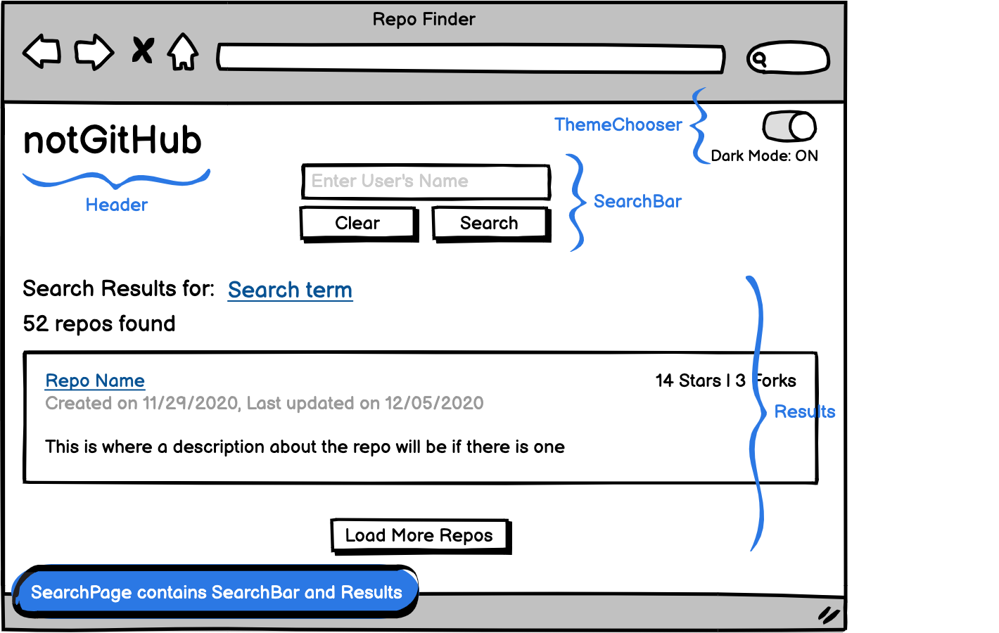

# Get User Repos

Type in a user’s name, click search and see a list of their up to their 10 most recently updated repos. If they have more repos, click Load More to view them 10 at a time in order from most recently to least recently updated.

## Installation

1. Clone down the repo
2. `cd` into get-user-repos
3. Run `npm i`
4. Run `npm start`
5. Search away!

## Dependencies

To ensure that dependencies were safe, I checked their health on Snyk, which covers both security and maintenance over time. Here is an example of the checkup on the [Apollo Client](https://snyk.io/advisor/npm-package/apollo-client).

### [React ^17.0.1](https://github.com/facebook/create-react-app)

This app was made with create-react-app. React makes it easy to build interactive single-page applications, and it’s a JavaScript library.

### [react-error-boundary "^3.1.0"](https://github.com/bvaughn/react-error-boundary#readme)

This component makes it easy to catch errors from a child component. Wrap it around the components that might throw, and then render a component to alert the user about what happened.

### [prop-types ^15.7.2](https://github.com/facebook/prop-types)

Prop-types provides run-time error checking for React. It also improves the tooltips associated with components, so you know exactly which props they need along with their types.

### [@apollo/client ^3.3.6"](https://github.com/apollographql/apollo-client), [apollo-link-error ^1.1.13](https://www.apollographql.com/docs/link/links/error/), [apollo-link-timeout ^4.0.0](https://github.com/drcallaway/apollo-link-timeout#readme), [graphql: ^15.4.0](https://graphql.org/)

The Apollo client, Hooks, and Links make it easier to work with GraphQL in React. With Link composition, we can also log errors (locally or remotely), set timeouts for requests, and more! They are highly customizable. Apollo also offers caching to increase request speed – if it’s cached it’s fast! GraphQL makes it easier to specify exactly what we want from a server with a JSON body.

### GitHub Personal Access Token

My PAT is in the .env in this project, and it’s required to run it, unless you make your own. I wouldn’t normally do this as it’s not a safe place for a PAT or any kind of API key.

## Requirements

### 1. You should be able to search for a user and see their repos

I used the Apollo hooks and client to satisfy this requirement. When a user types in a search term, and hits submit, a POST request is made via the Apollo useLazyQuery hook, which is necessary for putting off requests until an action occurs. At this time Apollo provides access to several variables, among them loading, error, and data. With this data, I was able to conditionally show errors, load status, and information about the user’s repos. The 10 most recently updated repos are returned. After that, a user can click Load More to see another 10 at a time added to the DOM until there are none left to show.

I decided not to allow a user to submit the same search twice in a row. I didn’t feel it was necessary to make an extra request as repos don’t change in the way that a social media feed does. Similarly, it doesn’t send any requests containing search terms that don’t conform to GitHub’s user name rules. Instead, the user sees an error so they can fix the input.

I used the Apollo Links to build a chain that could be adapted for use with a logging service or saving data locally. Right now it outputs errors and query data to the console for every request. I also used a Link to set a request timeout to ensure a user sees an error if a response is never received or takes too long.

For loading additional repos, I ended up requesting the next 10 using cursor pagination and merging the new response with the data already received. I would have liked to have figured out how to do this using the Apollo cache and fetchMore function, but I ran out of time to continue exploring that. I think it would have made for a cleaner project.

### 2. Dark Mode should be implemented, preferably without the white flash

I decided to use regular CSS for this requirement and a button that looks like a light bulb. When the button is clicked, it adds the “dark-theme” class to the body, which switches the color theme variables. Clicking it again switches to the “light-theme”, which is also the default theme. Every time the button is clicked, the theme is saved to local storage, and it’s retrieved when the app loads. To avoid the white flash, I set a background color on the body element in the public/index.html file above the body. This ensures that a middle-toned color loads first, so no white flash.

In terms of the folder/file structure of the CSS, I put all of my styles in a single styles folder to make them easy to find, and loaded them into index.js in the appropriate order. This has the drawback of possible naming collisions and overly selective selectors in large projects, but it has the benefit of making styles easy to find IMO. I do, however, like styles components also. To be honest, I argued with myself a lot over how to handle the styles and considered the effects on performance, such as first load, and ease of editing.

### 3. Testing, preferably, bonus with Cypress

There are unit tests included for every component inside the components folder and for most of those inside the domain folder. I tried to think about how another developer might try to use the component, what they would expect, and how I could test that, so as close to black box testing as possible. There is also a limited set of Cypress tests for end-to-end testing to check the basics of how a user might interact with the app. For example, I wanted to ensure search results showed on the page, that Dark Mode could be set, and that the search input could be cleared.

If I had more time, I would build out these tests more. Tests take a lot of careful thinking and planning, and I’d also never used Cypress before. However, I greatly enjoyed the introduction and will continue with it. I would also add contract testing to ensure that the API is returning what the app expects it to return: a regular schema check is vital to an app’s success. I also needed to test the SearchPage with a MockedProvider from Apollo, but due to time constraints, I was unable to do so.

## App Structure

The basic structure of the App is as follows (this is just a high-level view):

- App
  - Header
  - Dark Mode Switch
  - SearchPage
    - SearchBar
    - RequestError
    - Results
    - Loading
    - LoadMore

In retrospect, it would have made more sense to put the SearchBar and RequestError in a component together within SearchPage, since they are coupled in functionality. Similarly, Results, Loading, and LoadMore should have been placed in a component together for the same reason with appropriate headings.

There is so much refactoring I wish to do...

## Folder Structure

I decided to break up my folders into the following structure:

- src
  - components
  - constants
  - domain
  - hooks
  - styles
  - utils

The components folder contains general-purpose reusable components, like basic buttons and inputs, and the Dark Mode Switch. They are currently all unstyled, with the exception of the Dark Mode Switch, which does not appear on the page without styling, which I imagine might be confusing to others. This is a flat structure. Inside each folder, there are tests and any necessary assets.

The domain folder contains components specific to the app, such as the SearchPage and Header. These are unlikely to be reused, since they are rather specific in function. There is also a utils folder inside which contains app-specific utility functions that would be unlikely to be used elsewhere. Each component has its own tests folder, and if a component contains other components, it also contains those within its directory. However, it’s limited to a single level of depth. My hope is that this makes components easy to find without creating too-long of a list as the project grows.

The constants folder contains the constants the app relies on, such as the endpoint for GitHub, the request timeout setting, and more. The hooks folder contains a single hook, which is used to place aria labels an invalid input and return an error component based on the given status of the input. The utils folder inside of /src contains functions that could be reused in other apps. In this case, they’re all specific to Apollo.

## Planning

I planned the project around the following user stories:

### As a user I can:

- Type a user’s name into a field, click a button, and then see a list of their repositories
  - If the user does not exist, I should see a message telling me they don’t exist
- Clear my query by clicking a button
- See how many total repos the user has
- Click on a user’s name and go to their profile
- See 10 repos and their details
  - The name of the repo, which links to it
  - Clicking the link navigates to the repo in a new tab
  - The owner of the repo
  - How many times it has been starred
  - How many times it has been forked
  - When it was created
  - The last time it was updated
- If I want to see more repos, click a button below the list and view the next 10
  - There should be no repeated repos
  - The button should be disabled once the end of the list is reached
- Select a Dark or Light theme for the display
  - When I refresh the page, my selection should be recalled
- See an error message when something goes wrong, such as:
  - receiving a bad response
  - a response taking too long

**Extra**

As a user, it would be nice to have:

- A message appear when my search string does not meet GitHub’s username reqs

### As a dev I can:

- See a log of all queries performed by users
- See a log of all errors that occur during usage
- Easily navigate the app’s structure
- Use components of the app in a plug and play manner
- Update the app confidently by checking my code against tests
- Run tests I choose, rather than all of them, easily
- Test the user stories E2E
- Test custom hooks
- Ensure the responses received match the mocked responses

**As a dev, it would be nice to have:**

- Test checks integrated with GitHub to ensure deployed code is good code
- Contract tests that run daily to verify response structure
- A special command (Easter egg) that results in food showing up on my desk

I also created a simple wireframe to guide the styling:

I did not create storyboards due to the time constraints. I also felt that the user stories were enough to convey what should happen when different actions were taken. However, I’m always open to debate :)

_If you've made it to the end of this README, please treat yourself._

## Available Scripts

In the project directory, you can run:

### `npm start`

Runs the app in the development mode.\
Open [http://localhost:3000](http://localhost:3000) to view it in the browser.

The page will reload if you make edits.\
You will also see any lint errors in the console.

### `npm test`

Launches the test runner in the interactive watch mode.\
See the section about [running tests](https://facebook.github.io/create-react-app/docs/running-tests) for more information.

### `cypress open`

Launches Cypress. Start the app first with `npm start` or modify the script command to run both at the same time.

### `npm run build`

For deployment!
